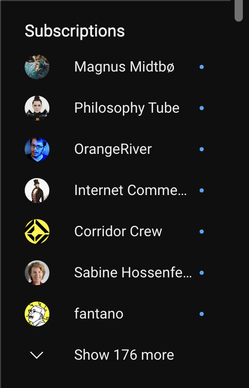

# ledit
A read-only Reddit/YouTube/Hackernews/RSS client for people who don't like bells and whistles. Ideal for content and comment browsing and nothing else.

[Try it](https://marioslab.io/projects/ledit)

# Usage
ledit lets you browse Reddit subreddits, YouTube channels, Hackernews, and RSS feeds in a desktop and mobile friendly way. It is aimed at consumption, not participation. Here's how you use it.

## Sources, Feeds, Posts
A source is a website or protocol which provides one or more feeds. Currently supported sources are Reddit, YouTube, Hackernews, and RSS. Each source has a prefix:

- Reddit: `r/`
- Hackernews: `hn/`
- RSS: `rss/`
- YouTube: `yt/`

A feed is a stream of posts or articles. Currently supported feeds are Reddit subreddits, YouTube channels, and RSS feeds. Hackernews is special, in that it is a single feed source. Posts in a feed may optionally be sorted by some criteria depending on the source. E.g. posts of a subreddit can be sorted or filtered by hot, new, rising, and so on. Posts from Hackernews can be filtered by news, new, ask HN, show HN, etc.

A feed is identified by a name or url in combination with its source's prefix. E.g. the subreddit `cats` is identified by `r/cats`, the YouTube channel "Vertiasium" is identified by `yt/vertiasium`, the RSS feed of Ars Technica is identified by `rss/https://feeds.arstechnica.com/arstechnica/index`.

A post consists of at least of a title, link, and publication date. It may optionally include a preview, comments, and a score, which ledit will happily display.

## Viewing one or more feeds
To open a feed from a source in ledit, click the currently displayed feed's name in the header, enter the new feed's name, e.g. `r/cats`, `yt/veritasium`, `hn/`, or `rss/https://feeds.arstechnica.com/arstechnica/index`, and press enter.

ledit will then load and show the new feed's posts.

In case of Reddit, YouTube, and RSS, you can view multiple feeds at once. Concatenate the feed names or URls with a `+`. E.g. `r/cats+dogs` will show posts from both subreddits `cats` and `dogs`, `r/redlettermedia+veritasium` will show videos from the YouTube channels Red Letter Media and Veritasium, `rss/https://feeds.arstechnica.com/arstechnica/index+https://techcrunch.com/feed/` will show posts from both Ars Technica and TechCrunch.

Depending on the source, you can sort or filter the currently displayed feed. Use the select box in the top right corner to do so. For Reddit feeds, you can sort by new, rising, etc. For the singular Hackernews feed, you can filter by news, ask HN, show HN, and so forth. YouTube channels and RSS feeds to not offer sorting options. Instead, posts are sorted by publication date.

## Post previews
A post may have preview content, such as the text of a self-post on Reddit, images, videos, and so on.

If the preview content is very large, ledit will limit its height. Click the "Show more" button or anywhere in the visible part of the preview to expand it to its full height. Click the contents of the expanded preview again to collapse it again.

If the preview content is an image gallery, ledit will display an gallery icon together with the number of images in the gallery at the bottom of the post. Click the image itself (not the icon) to expand the gallery. Click any image in the gallery to collapse the gallery again.

If you've started a video and scroll it out of view, ledit will automatically pause it.

## Comments
If a post has comments, ledit will show a comment icon and the number of comments at the bottom of the post. To view the comments, click the comment icon. To collapse the comments, click the comment icon again. Alternatively, you can press the `Escape` key, or swipe back on mobile to collapse the comment section.

You can click on any comment to collapse or expand its child comments.

## Bookmarks
Manually entering feed names all the time is tedious. Instead, you can bookmark the currently viewed feed by clicking the bookmark item in the top right corner.

To access you bookmarks, click the icon in the top left corner. To open a bookmark, click its name.

To make the bookmark the default feed to view when you open ledit, click the bookmark's checkmark.

Clock the pencil to edit a bookmark. You can give it a memorable label. You can also specify additional feeds in the text area by separating them via `,` or a new line. This is often more comfortable compared to entering multiple feeds in the single line text input in the header of the site.

To remove the bookmark, click `-`.

Instead of clicking `X`, you can press the `Escape` key, or swipe back on mobile to close the bookmarks

## Settings
To access the settings, click the icon in the top left corner. The settings are displayed after the bookmarks.

You can choose between the `Light` and `Dark` theme in the `Theme` section.

You can toggle collapsing of already seen posts in the `View options` section. A post is considered seen as soon as its visible in the browser window. In its collapsed form, ledit will gray it out and only show the most basic information, to make it visually obvious that you've seen this post before.

The `Hide seen posts` setting is actually more of an action. It will remove all seen posts from the currently viewed stream. If no posts are left to be shown, ledit will automatically fetch older posts from the feed. This option is useful if the feed you view hasn't had recent posts and you just want to binge consume.

At the bottom of the settings, you'll find `Rest to defaults`. Clicking this will delete all your bookmarks and replace them with the default bookmarks. It will also reset the theme and view options. Use with care: removed bookmarks can only be restored by re-entering their source prefix and name or URL!

Instead of clicking the `X` in the top left corner to close the settings, you can also press the `Escape` key on the desktop, or swipe back on your mobile phone.

## FAQ
### Is there a way to import my YouTube subscriptions?
Well, yes, but it's not for the faint of heart :)

Here's how you can do it with Chrome/Safari/Firefox on the desktop.

1. Open  `https://www.youtube.com/feed/subscriptions` in your browser. You must be logged in.
2. On the right side, locate the list of subscriptions and click "Show x more" so all your subscriptions are visible in the list. 
3. In the same browser tab, while viewing your subscriptions, enter `javascript:"https://marioslab.io/projects/ledit/#yt/" + Array.from(document.querySelectorAll('a[id="endpoint"]')).filter((link) => link.getAttribute("href") && link.getAttribute("href").startsWith("/@")).map((link) => link.getAttribute("href").substring(2)).join("+")` in the browser address bar and press enter. You should see a link to `https://marioslab.io/projects/ledit`. **NOTE:** copy & pasting the above may omit the `javascript:` part when pasting into the browser address bar. You have to manually add it once pasted.
4. Copy the link and open it in another tab. If you have hundreds of subscriptions, the initial loading will take a while. Subsequent loading will be much faster! You are now browsing your subscriptions on ledit. Click the bookmark icon in the top left to bookmark them.


# Development
You'll need [Node.js](https://nodejs.org/en) for development. Assuming you have Node installed:

```
git clone https://github.com/badlogic/ledit && cd ledit
npm install
npm run dev
```

This will start a local web server that serves the files in `site/` on http://localhost:8080. If you make changes to the sources, the browser automatically reloads.

If you use VS Code (you should), then open the `ledit/` folder and run the `ledit` launch configuration. A browser window will open, showing what's served on http://localhost:8080. You can then set breakpoints, change code and save in VS Code, and see your changes applied instantly.

# Deployment
```
npm install
npm run build
```

Copy the contents of the `site/` folder to a web server.
